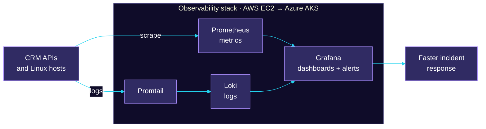

<!-- ============================================================
  Kunal Kanaujiya · GitHub profile README
  Palette: midnight #0f0c29 · indigo #302b63 · violet #a78bfa · cyan #22d3ee
  Paste into: github.com/itskunalkanaujiya/itskunalkanaujiya/README.md
============================================================ -->

<!-- ─────────────────────────  HEADER  ───────────────────────── -->

<div align="center">


<a href="https://github.com/itskunalkanaujiya">
  
</a>

<br/>

<a href="https://www.linkedin.com/in/kunal-kanaujiya-2719902a4/"></a>
<a href="mailto:kunalkanaujiya@123gmail.com"></a>
<a href="https://www.geeksforgeeks.org/profile/kunalkanaujiya"></a>
<a href="https://leetcode.com/u/7754024423/"></a>

<br/>


</div>

<br/>

<!-- ─────────────────────────  AT A GLANCE  ───────────────────────── -->

<table align="center" width="100%">
  <tr>
    <td align="center" width="25%">
      <h2>9.46</h2>
      <sub><b>CGPA</b><br/>B.Tech CSE (AI)</sub>
    </td>
    <td align="center" width="25%">
      <h2>500+</h2>
      <sub><b>DSA PROBLEMS</b><br/>LeetCode + GfG</sub>
    </td>
    <td align="center" width="25%">
      <h2>98%</h2>
      <sub><b>PRECISION</b><br/>Spam detection model</sub>
    </td>
    <td align="center" width="25%">
      <h2>#11</h2>
      <sub><b>INSTITUTE RANK</b><br/>GeeksforGeeks</sub>
    </td>
  </tr>
</table>


<!-- ─────────────────────────  ABOUT  ───────────────────────── -->

<div align="center">
  
</div>

I'm a final-year Computer Science (AI) student at **IET Lucknow** who enjoys building LLM and machine learning systems that are **grounded, explainable, and measured**, plus the infrastructure that keeps them healthy in production. Right now I'm an **LLM Intern at PanScience Innovations**, running observability stacks and moving them onto Kubernetes.

```yaml
name:       Kunal Kanaujiya
role:       LLM Intern @ PanScience Innovations LLP
education:  B.Tech CSE (AI) · IET Lucknow · CGPA 9.46 · 2027
building:   [RAG systems, explainable ML, Kubernetes observability]
solving:    500+ DSA problems across LeetCode and GeeksforGeeks
principle:  "If it can't be measured, it isn't finished."
```

<br/>

<!-- ─────────────────────────  WHAT I WORK ON  ───────────────────────── -->

<table align="center" width="100%">
  <tr>
    <td valign="top" width="33%">
      <h3>🧠 Grounded LLM Apps</h3>
      <sub>RAG pipelines with <b>LangChain</b>, <b>FAISS</b> / <b>ChromaDB</b> and the <b>Groq API</b>, built so answers stay tied to their sources.</sub>
    </td>
    <td valign="top" width="33%">
      <h3>🔍 Explainable ML</h3>
      <sub>Classical ML with <b>scikit-learn</b> and <b>XGBoost</b>, opened up with <b>SHAP</b> and judged by proper evaluation metrics.</sub>
    </td>
    <td valign="top" width="33%">
      <h3>☁️ Observability & Cloud</h3>
      <sub><b>Prometheus</b>, <b>Grafana</b> and <b>Loki</b> on AWS EC2, containerized with Docker and migrated to <b>Azure Kubernetes Service</b>.</sub>
    </td>
  </tr>
</table>


<!-- ─────────────────────────  TECH STACK  ───────────────────────── -->

<div align="center">
  
</div>

<table align="center" width="100%">
  <tr>
    <td align="center" width="180"><sub><b>LANGUAGES</b></sub></td>
    <td>
      &nbsp;&nbsp;
      &nbsp;&nbsp;
      &nbsp;&nbsp;
      
    </td>
  </tr>
  <tr>
    <td align="center"><sub><b>GENERATIVE AI<br/>& MACHINE LEARNING</b></sub></td>
    <td>
      &nbsp;&nbsp;
      &nbsp;&nbsp;
      &nbsp;&nbsp;
      &nbsp;&nbsp;
      &nbsp;&nbsp;
      &nbsp;&nbsp;
      
      <br/>
      <sub>FAISS · ChromaDB · Groq API · XGBoost · SHAP · NLTK · Matplotlib · Seaborn</sub>
    </td>
  </tr>
  <tr>
    <td align="center"><sub><b>CLOUD & DEVOPS</b></sub></td>
    <td>
      &nbsp;&nbsp;
      &nbsp;&nbsp;
      &nbsp;&nbsp;
      &nbsp;&nbsp;
      &nbsp;&nbsp;
      &nbsp;&nbsp;
      &nbsp;&nbsp;
      
      <br/>
      <sub>Loki · Promtail · EC2 · AKS · CI/CD pipelines</sub>
    </td>
  </tr>
  <tr>
    <td align="center"><sub><b>TOOLS</b></sub></td>
    <td>
      &nbsp;&nbsp;
      &nbsp;&nbsp;
      &nbsp;&nbsp;
      &nbsp;&nbsp;
      
      <br/>
      <sub>Claude Code</sub>
    </td>
  </tr>
</table>


<!-- ─────────────────────────  EXPERIENCE & EDUCATION  ───────────────────────── -->

<div align="center">
  
</div>

<br/>

<!-- ── Role 1 · PanScience ── -->
<table width="100%">
  <tr>
    <td width="27%" valign="top">
      <h3>🚀 LLM Intern</h3>
      <b>PanScience Innovations LLP</b>
      <br/><br/>
      <br/>
      <br/>
      
    </td>
    <td valign="top">
      
      
      
      <br/><br/>
      <ul>
        <li><b>Centralized observability on AWS EC2</b>: architected the stack (Prometheus, Grafana, Loki, Promtail) with Linux provisioning, scrape targets, retention policies, and secure private-subnet access via SSH port forwarding.</li>
        <li><b>Dashboards & alerting</b>: designed multi-tier Grafana dashboards and alerts for CRM API latency, error rates, and system health, reducing manual log inspection and accelerating <b>MTTR</b>.</li>
        <li><b>Docker → Azure Kubernetes Service</b>: containerized the stack and led its migration to AKS using Deployments, Services, ConfigMaps, PVCs, and deployment pipelines, supporting the organization's Kubernetes adoption.</li>
      </ul>
      
      
      
      
      
      
      
      
    </td>
  </tr>
</table>

<details open>
<summary><b>🗺️ Observability architecture</b></summary>



</details>

<br/>

<!-- ── Role 2 · CodeAlpha ── -->
<table width="100%">
  <tr>
    <td width="27%" valign="top">
      <h3>🤖 ML Intern</h3>
      <b>CodeAlpha</b>
      <br/><br/>
      <br/>
      <br/>
      
    </td>
    <td valign="top">
      
      
      
      
      <br/><br/>
      <ul>
        <li><b>End-to-end ML delivery</b>: EDA, preprocessing, feature engineering, model selection, hyperparameter optimization, and evaluation with Python and scikit-learn.</li>
        <li><b>Spam Detection System</b>: TF-IDF with Multinomial Naive Bayes, reaching <b>98% precision</b> and <b>97% recall</b> on 5,500+ messages.</li>
        <li><b>Content-Based Movie Recommender</b>: CountVectorizer and cosine similarity across 5,000+ movies, documented on GitHub.</li>
      </ul>
      
      
      
      
    </td>
  </tr>
</table>

<br/>

<!-- ── Education ── -->
<table width="100%">
  <tr>
    <td width="27%" valign="top">
      <h3>🎓 B.Tech · CSE (AI)</h3>
      <b>IET Lucknow</b>
      <br/><br/>
      <br/>
      
    </td>
    <td valign="top">
      <ul>
        <li>Final-year Computer Science (Artificial Intelligence) student with a <b>9.46 CGPA</b>.</li>
        <li>Sharpened problem-solving through <b>500+ DSA problems</b> and a <b>GeeksforGeeks Institute Rank of #11</b>.</li>
        <li>Competed in three hackathons, including <b>Smart India Hackathon</b> and <b>Hack-O-Fiesta at IIIT Lucknow</b>.</li>
      </ul>
    </td>
  </tr>
</table>

<br/>


<!-- ─────────────────────────  ACHIEVEMENTS  ───────────────────────── -->

<div align="center">
  
</div>

<div align="center">

<sub><b>COMPETITIVE PROGRAMMING</b></sub><br/><br/>


<br/>

<sub><b>HACKATHONS</b></sub><br/><br/>


</div>

<br/>


<!-- ─────────────────────────  GITHUB ACTIVITY  ───────────────────────── -->

<div align="center">
  
</div>

<div align="center">


</div>

<br/>


<!-- ─────────────────────────  CONTACT + FOOTER  ───────────────────────── -->

<div align="center">


<p>Open to internships and collaborations in <b>LLM applications, RAG, MLOps, and cloud-native systems</b>.<br/>If you're building something interesting, I'd love to hear about it.</p>

<a href="https://www.linkedin.com/in/kunal-kanaujiya-2719902a4/"></a>
<a href="mailto:kunalkanaujiya@123gmail.com"></a>

<br/><br/>

<i>"If it can't be measured, it isn't finished."</i>

<br/>


</div>
